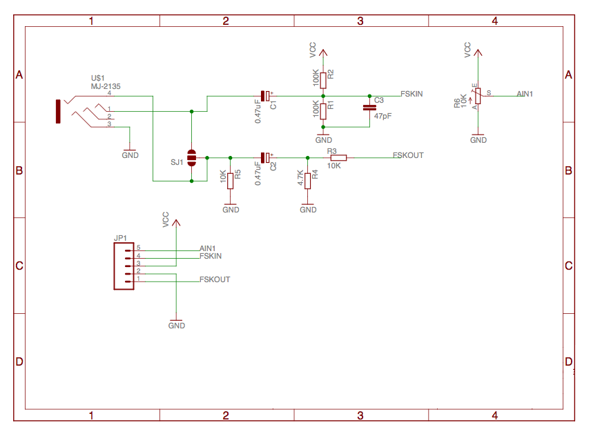

# AVR Communication via Audio Jack
AVR-CVA is a wired, low-cost and platform independent solution for communication between an AVR and mobile phones. It uses the phone's audio jack and Bell 202 modem-like FSK encoding with up to 1225 bit/s. This project is extended from [SoftModem](https://github.com/arms22/SoftModem/).

## Manual install
Place these files inside your `libraries` folder.

## Supported Micros
- ATmega16
- ATmega32

## Hardware
